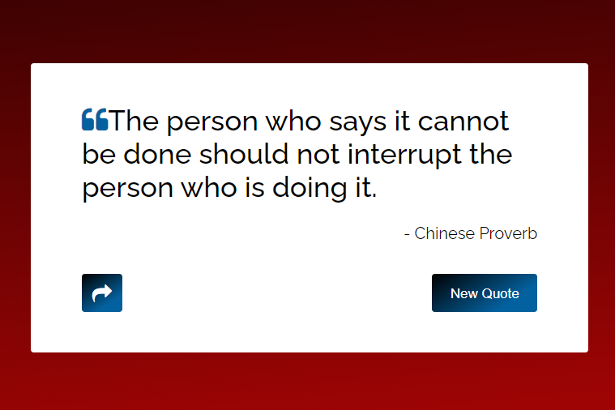

# Quote Generator

A simple web page that generates random quotes.

## Description

The Quote Generator is a web page that displays random quotes fetched from a JSON file. It allows users to view a new quote by clicking the "New quote" button. Additionally, users can share the displayed quote through various platforms using the "Share Quote" button.

## Features

- Fetches random quotes from a JSON file
- Displays the quote text and author
- Generates a new quote on button click
- Shares the quote through the Web Share API or a fallback prompt

## Technologies Used

- HTML
- CSS
- JavaScript

## Setup and Usage

1. Clone the repository or download the project files.
2. Open the `index.html` file in a web browser.
3. Click the "New quote" button to display a random quote.
4. Click the "Share Quote" button to share the quote (if supported).

## Customization

To customize the quotes displayed by the Quote Generator, you can modify the `quotes.json` file. Add or remove quotes in the following format:

    json
    {
      "quote": "This is a quote.",
      "author": "John Doe"
    }
Feel free to modify and update the [README.md](README.md) file according to your specific needs and project details.

## Compatibility

The Quote Generator is compatible with modern web browsers, including Chrome, Firefox, Safari, and Edge.

## Project Link

For a live demo of the Quote Generator, visit [Quote Generator](https://raviruler.github.io/Quote_Generator/).